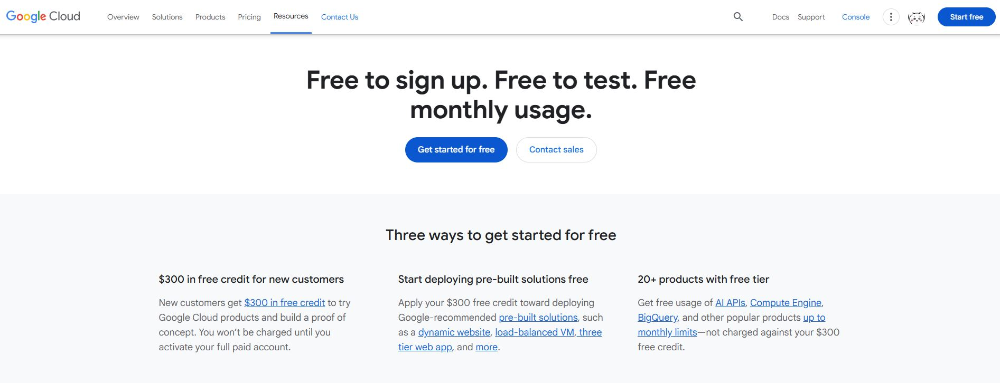
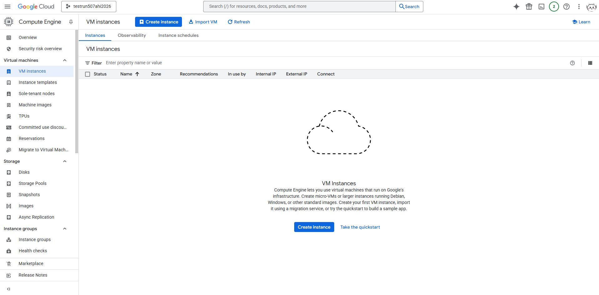
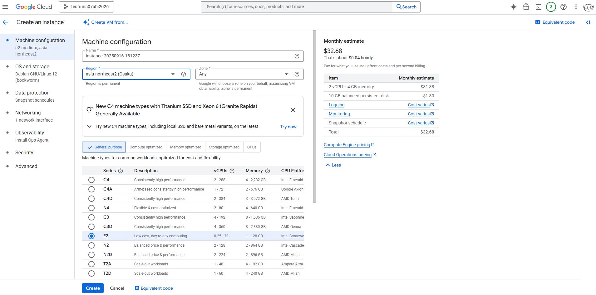
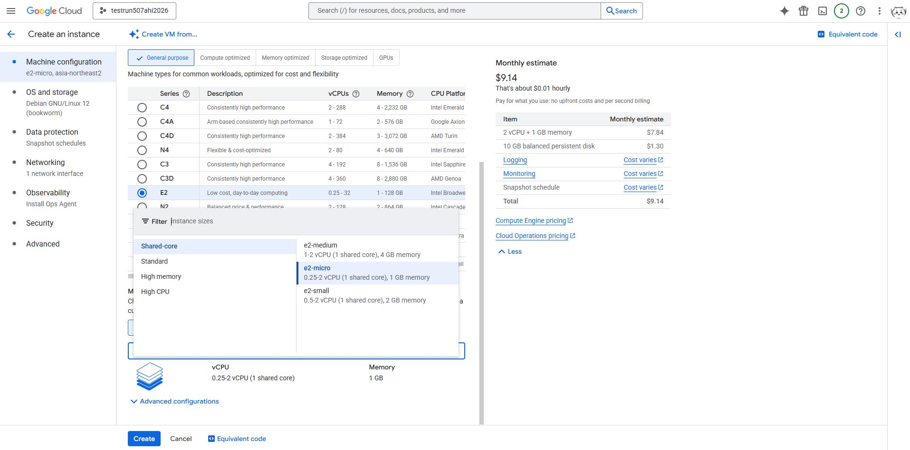
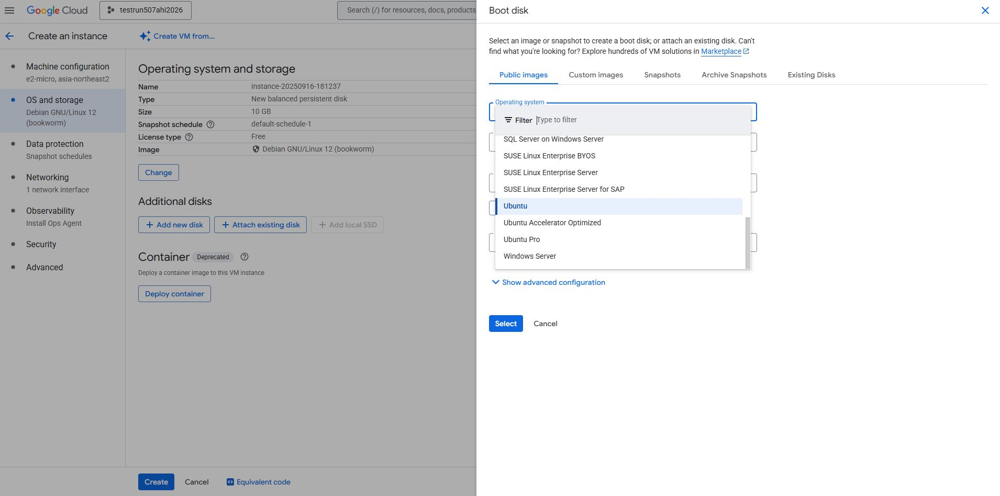

# 504-Assignment-1-

Below includes links for tutorials on how to create virtual machines for Google Cloud and Microsoft Azure 

## Google Cloud
https://console.cloud.google.com/ 

### Google Cloud Video 
https://drive.google.com/file/d/1Us3TFXkfm0VaTrcBnXLNzoxNcZWbXslp/view?usp=drive_link

### Google Cloud  Set up Tutorial

#### Step 1

Go to https://console.cloud.google.com/, then log in or create account. 

#### Step 2 
There are two ways to create a VM instance
A) Click + Create a VM in the middle
B) Go to the left drop down menu. Under products, go to Compute Engine, then go to Virtual machines and click VM instances.  

#### Step 3

Once in the VM instance page, click "Create Instance"

#### Step 4 

Create a Name for your VM instance, select region and zone
Note: Select the region closest to your geographical region to decrease latency. For example, if you are in Kyoto, JPN then select Osaka, JPN for region. 

#### Step 5

Under General purpose, select Machine type Series for your virtual machine. Specs for each machine type are listed to the right of the Series. Please look over the specs and note that selections vary in pricing. 

Then under machine type select preset then select the settings for vCPUs and Memory for your virtual machine.

For the purpose of this example we will be selecting a small virtual machine meant for remote work. Selection for this example is E2 with a machine type preset of e2-micro(2 vBPU, 1 GB memory). 

#### Step 6

For Operating system and storage, choose the settings under change and switch the selections to your preference for the vitual machine. 
Note: there may be two different variants of the same version which uses either arm64 or x86/64 . Compatability varies with machine series. 

For this example we will be selecting Operating system Ubantu version 25.04 with a balanced persistent disk and 10 GB. 

#### Step 7 

On the Data protection page please select and configure your preferred backup plans. You can choose to have a full on back up plan, a snapshop schedule or no back up plan. 

Underneath networking you can choose to set up fire wall and Network performance configuration.

In the security tab you can select identity and API access and configure access scopes to your personal preference. 

#### Step 8 
 Select create and then give the server a few seconds to a few minutes to fully load your virtual machine. When you see the green checkmark in status on the VM instance page, the VM is now online and ready to use 

#### Deleting your VM

In VM instances select the three dot icon for more actions then select delete. A pop up will come up to confirm if you wish to delect the VM instance. Select Delete and then give the server a few minutes to suspend and delete the VM instance. When the VM has been delected a pop up on the bottom will show up as instance deleted and a notification on the top right will confirm deletion. 

 

## Microsoft Azure
https://azure.microsoft.com/en-us

### Microsoft Azure Video
https://drive.google.com/file/d/1VoNk5yK8lR3kxSSYOisAT549nu0vu-Xb/view?usp=drive_link

### Microsoft Azure Tutorial

#### Step 1 

#### Step 2 

#### Step 3

#### Step 4 

#### Step 5

#### Step 6

#### Step 7 

# Reflections
## Similarities
## Differences
## Preference (Google Cloud vs Microsoft Azure) and Why

Image in corner right was to authenticate and verify videos to match the icon for this account. 

