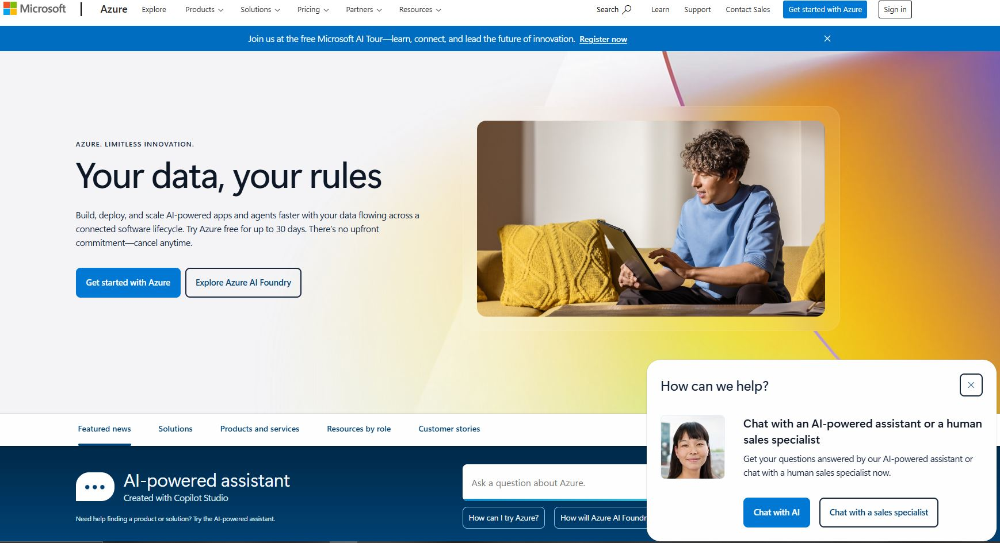
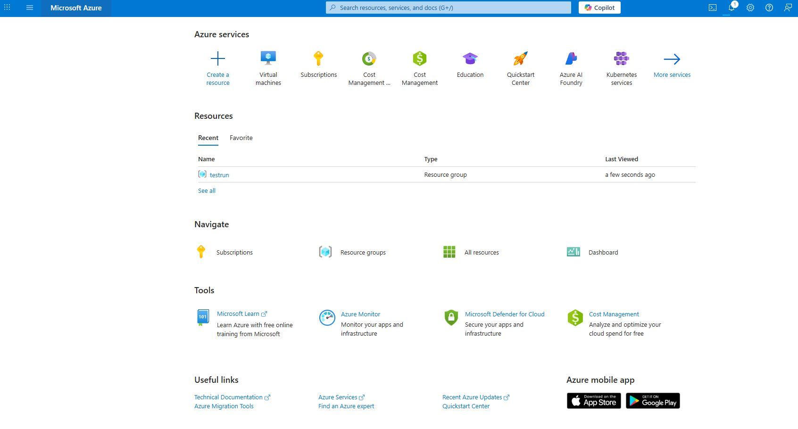
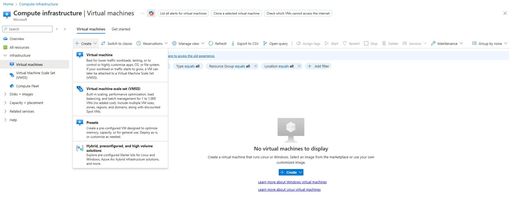
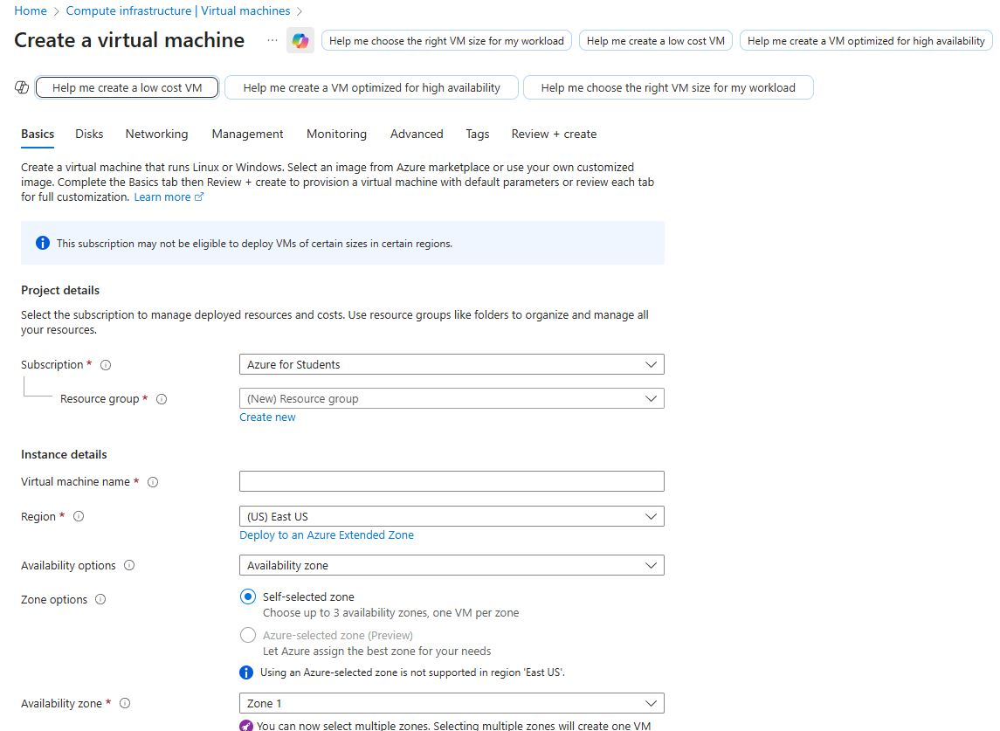

# 504-Assignment 1 - VM tutorial

Below includes links for tutorials on how to create virtual machines for Google Cloud and Microsoft Azure 

## Google Cloud
https://console.cloud.google.com/ 

### Google Cloud Video 
https://drive.google.com/file/d/1Us3TFXkfm0VaTrcBnXLNzoxNcZWbXslp/view?usp=drive_link

### Google Cloud  Set up Tutorial

#### Step 1

Go to https://console.cloud.google.com/, then log in or create account. 

#### Step 2 
There are two ways to create a VM instance
A) Click + Create a VM in the middle
B) Go to the left drop down menu. Under products, go to Compute Engine, then go to Virtual machines and click VM instances.  

#### Step 3

Once in the VM instance page, click "Create Instance"

#### Step 4 

Create a Name for your VM instance, select region and zone
Note: Select the region closest to your geographical region to decrease latency. For example, if you are in Kyoto, JPN then select Osaka, JPN for region. 

#### Step 5

Under General purpose, select Machine type Series for your virtual machine. Specs for each machine type are listed to the right of the Series. Please look over the specs and note that selections vary in pricing. 

Then under machine type select preset then select the settings for vCPUs and Memory for your virtual machine.

For the purpose of this example we will be selecting a small virtual machine meant for remote work. Selection for this example is E2 with a machine type preset of e2-micro(2 vBPU, 1 GB memory). 

#### Step 6

For Operating system and storage, choose the settings under change and switch the selections to your preference for the vitual machine. 
Note: there may be two different variants of the same version which uses either arm64 or x86/64 . Compatability varies with machine series. 

For this example we will be selecting Operating system Ubantu version 25.04 with a balanced persistent disk and 10 GB. 

#### Step 7 

On the Data protection page please select and configure your preferred backup plans. You can choose to have a full on back up plan, a snapshop schedule or no back up plan. 

Underneath networking you can choose to set up fire wall and Network performance configuration.

In the security tab you can select identity and API access and configure access scopes to your personal preference. 

#### Step 8 
 Select create and then give the server a few seconds to a few minutes to fully load your virtual machine. When you see the green checkmark in status on the VM instance page, the VM is now online and ready to use 

#### Deleting your VM

In VM instances select the three dot icon for more actions then select delete. A pop up will come up to confirm if you wish to delect the VM instance. Select Delete and then give the server a few minutes to suspend and delete the VM instance. When the VM has been delected a pop up on the bottom will show up as instance deleted and a notification on the top right will confirm deletion. 

 

## Microsoft Azure
https://azure.microsoft.com/en-us

### Microsoft Azure Video
https://drive.google.com/file/d/1VoNk5yK8lR3kxSSYOisAT549nu0vu-Xb/view?usp=drive_link

### Microsoft Azure Tutorial

#### Step 1 

Go to https://azure.microsoft.com/en-us/. Click Sign in to Log in or create a new account. 

#### Step 2 

Under Azure services click Virtual Machines to go to the Virtual Machine page. 

#### Step 3

When in the Virtual Machine page click create to start creating a new  virtual machine. Drop down menu will appear giving multiple options for machine types. Click on Virtual machine.  

#### Step 4 

Add in project details such as subscription and resource group. You can chose to create a new resource group. 

Then add in instance details such as machine name. 

 

#### Step 5

For selecting region, select the closest region to your location. The for zone options keep self-selected zone and select your availability zone. Please note: you are now able to select multiple zones however this will create one VM per zone. 

#### Step 6

For Security type, click the drop down menu to select your preferred security type for your virtual machine. 

#### Step 7 

For Image, please select your operating system for your VM and VM architecture. You may proceed to select size for your VM size in the drop down menu. 
Please note: Size varies depending on machine settings and cpu count. 

For the purpose of this example, we will be selecting Ubuntu Server 24.04 LTS x64 Gen2 with a 1vcpu, 0.5 GiB memory. 

#### Step 8 

For administrator account, we will be selecting Password as Authentication type. Here you can create a admin username and password for the virtual machine.

For this example we will be setting our username as Dog and Password as Woofwoof123456789

#### Step 9 

For Inbound port rules, you may select on whether your virtual machine allows public inbound ports or none. 

For this example we will select none. 

#### Step 10

For Disks, you may choose your OS settings such as disk size, disk type and key management. 

For this example we will keep OS disk size to Image default with an OS disk type of premium SSD

#### Step 11

For Network, we will be keeping public IP and Public inbound ports to None, and NIC network security group to Basic. 

#### Step 12

After reviewing selections, you may click Review + create and then create to launch your Virtual Machine. It may take a few seconds to minutes for the Virtual machine to be up and running. A pop up may show up as Initializing deployement and then deployment is in progress during launch. Then once deployment is done you will see a green checkmark with Your deployment is complete.

#### Deleting of your VM

To delete your virtual machine, click the box next to the name then select the Delete button towards the top. It will then ask you to type delete as confirmation to delete the virtual machine. Then another pop up will show again to reconfirm deletion. Give the server a few seconds to a minute to delete the machine. Eventually you will get a notification which says Executed delete command on 1 selected items 

# Reflections

Both virtual machine platforms are relatively beginner friendly and easy to deploy. 

## Similarities

Both platforms have wide availability across mutliple servers and geographical locations. Both platforms also have flexible pricing for server maintenence and uptime. 

## Differences

Noteable key differences between Google Cloud and Microsoft Azure are as follows: 

| Google Cloud |  Microsoft Azure |
| ---------- | ----------|
| Has more region availability | More Zone availability per region |
| More flexible pricing for Remote work or smaller companies |  More streamlined for business integration with other microsoft products |

## Preference (Google Cloud vs Microsoft Azure) and Why

For a smaller party either individual or small party, Google Cloud seems more prefereable due to friendlier pricing options and more region availability. Microsoft azure locks out the ability to run servers in other continents which may not be favorable.

However for medium to larger scale companies, Azure is more preferred due to its streamline ease of use with other microsoft products and wider use in current business operations. 

Image in corner right was to authenticate and verify videos to match the icon for this account. 

